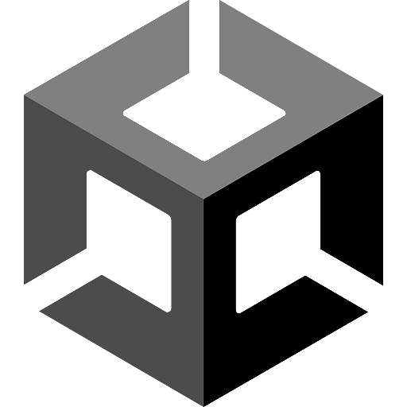

[![Contributors][contributors-shield]][contributors-url]
[![Forks][forks-shield]][forks-url]
[![Stargazers][stars-shield]][stars-url]
[![Issues][issues-shield]][issues-url]
[![Unlicense License][license-shield]][license-url]

[![C#][CSharp]][CSharp-url]

<!-- PROJECT LOGO -->
 

  

<h3 align="center">Pong Multiplayer Project</h3>

  

    Projeto desenvolvido em Unity para a Universidade Senac Santo Amaro
     
    <a href="https://github.com/Senac-Code-Nuts/Multiplayer-Pong-Project"><strong>Veja a documentação »</strong></a>
     
     
    <a href="https://github.com/Senac-Code-Nuts/Multiplayer-Pong-Project/releases">Ver Demonstração</a>
    &middot;
    <a href="https://github.com/Senac-Code-Nuts/Multiplayer-Pong-Project/issues/new?labels=bug&template=bug-report---.md">Reportar Bug</a>
    &middot;
    <a href="https://github.com/Senac-Code-Nuts/Multiplayer-Pong-Project/issues/new?labels=enhancement&template=feature-request---.md">Sugerir Funcionalidade</a>
  

## Estrutura de Pastas

O projeto segue uma organização feature-based. Veja o objetivo de cada pasta principal:

- **_Core/**: Scripts e assets centrais, utilitários e sistemas fundamentais usados por todo o projeto (ex: Input, Managers).
- **_Dev/**: Onde você coloca arquivos, scripts, ferramentas, cenas ou assets que são usados apenas durante o desenvolvimento e não vão para produção.
- **_Shared/**: Assets e scripts compartilhados entre diferentes features.
- **_ThirdParty/**: Plugins, assets e bibliotecas de terceiros.
- **Features/**: Cada subpasta representa uma feature (funcionalidade) do jogo. Dentro de cada feature, organize por Animations, Audio, Materials, Prefabs, Scripts e UI.
- **Scenes/**: Cenas do Unity usadas no projeto.
- **Settings/**: Configurações globais do projeto, como perfis de renderização, áudio, qualidade, etc.

Mantenha cada asset na pasta correspondente para garantir organização e facilitar o trabalho em equipe.

## Créditos

CI/CD providenciados pelo [GameCI](https://game.ci/) e GitHub Actions.

(<a href="#readme-top">back to top</a>)

<!-- MARKDOWN LINKS & IMAGES -->
[contributors-shield]: https://img.shields.io/github/contributors/Senac-Code-Nuts/Multiplayer-Pong-Project.svg?style=for-the-badge
[contributors-url]: https://github.com/Senac-Code-Nuts/Multiplayer-Pong-Project/graphs/contributors
[forks-shield]: https://img.shields.io/github/forks/Senac-Code-Nuts/Multiplayer-Pong-Project.svg?style=for-the-badge
[forks-url]: https://github.com/Senac-Code-Nuts/Multiplayer-Pong-Project/network/members
[stars-shield]: https://img.shields.io/github/stars/Senac-Code-Nuts/Multiplayer-Pong-Project.svg?style=for-the-badge
[stars-url]: https://github.com/Senac-Code-Nuts/Multiplayer-Pong-Project/stargazers
[issues-shield]: https://img.shields.io/github/issues/Senac-Code-Nuts/Multiplayer-Pong-Project.svg?style=for-the-badge
[issues-url]: https://github.com/Senac-Code-Nuts/Multiplayer-Pong-Project/issues
[license-shield]: https://img.shields.io/github/license/Senac-Code-Nuts/Multiplayer-Pong-Project.svg?style=for-the-badge
[license-url]: https://github.com/Senac-Code-Nuts/Multiplayer-Pong-Project/blob/master/LICENSE.txt
[Unity]: https://img.shields.io/badge/Unity-000000?style=for-the-badge&logo=unity&logoColor=white
[Unity-url]: https://unity.com/
[CSharp]: https://img.shields.io/badge/C%23-239120?style=for-the-badge&logo=dotnet&logoColor=white
[CSharp-url]: https://docs.microsoft.com/en-us/dotnet/csharp/